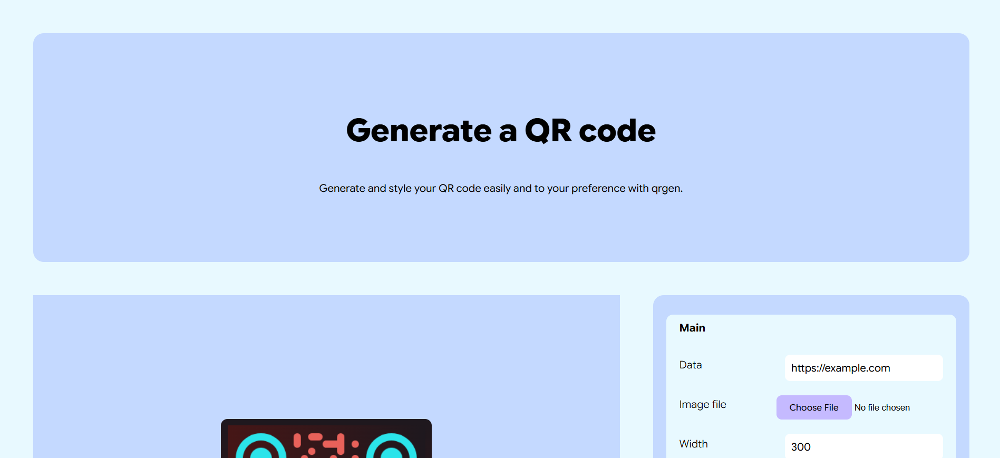

# qrgen
A simple QR code generator, where the user can personalize it to their heart's content.

## Features
- Basic QR code generation
- Customizable size, margin, shape
- Customizable dot styles and color (incl. gradients)
- Customizable outer and inner corner (separate) styles and color (incl. gradients)
- Customizable background color (incl. gradients)
- Uploadable image to be placed in the center of the QR code
- Customizable image size, margin and background opacity (1 or 0)
- Downloadable as PNG

### Local setup
Apart from cloning the repository, no other setup is needed, because this is a static website, and all dependencies are loaded via a CDN.